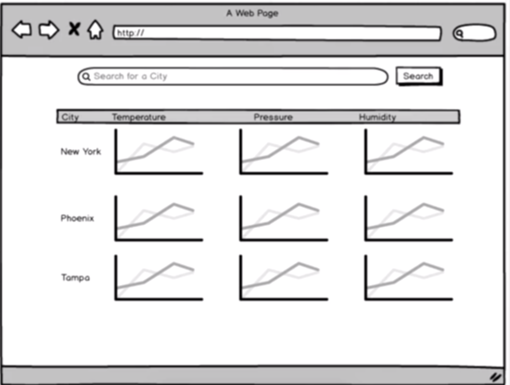

# ReduxSimpleStarter

Interested in learning [Redux](https://www.udemy.com/react-redux/)?

### Getting Started

There are two methods for getting started with this repo.

#### Familiar with Git?
Checkout this repo, install dependencies, then start the gulp process with the following:

```
> git clone https://github.com/StephenGrider/ReduxSimpleStarter.git
> cd ReduxSimpleStarter
> npm install
> npm start
```

#### Not Familiar with Git?
Click [here](https://github.com/StephenGrider/ReactStarter/releases) then download the .zip file.  Extract the contents of the zip file, then open your terminal, change to the project directory, and:

```
> npm install
> npm start
```

### Project Summary
how to make async calls with Redux like Ajax requests

#### architecture and challenges of weather forecast browser
*Architecture*


*First challenge*

we need to centralize all logic into reducers and actions as much as possible and instead react components are only responsible for showing data they're not responsible for fetching data at all

*Second challenge*

to figure out how to do line chart for weather broadcast by using 3rd party library

*Third challenge*

how to deal with redux application where state changes significantly over time
